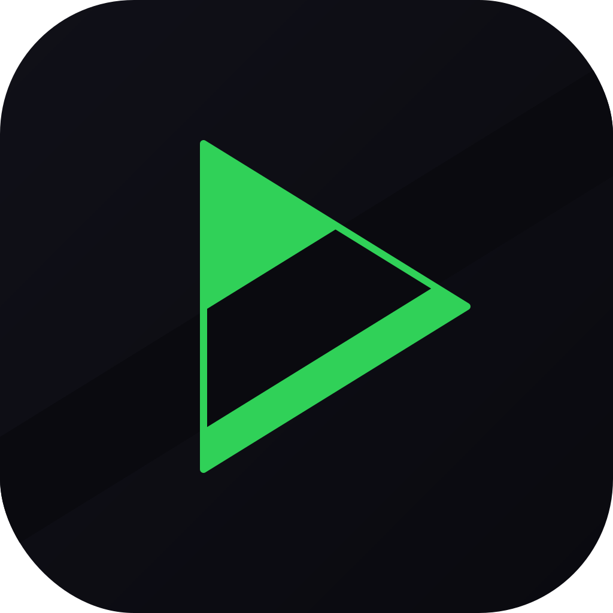
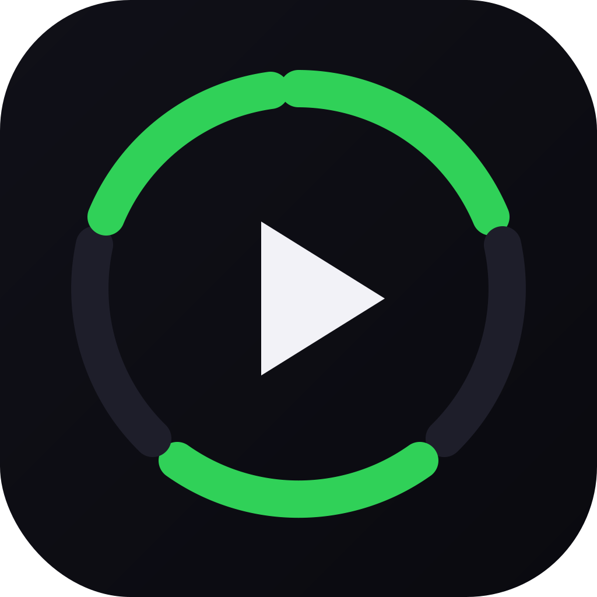
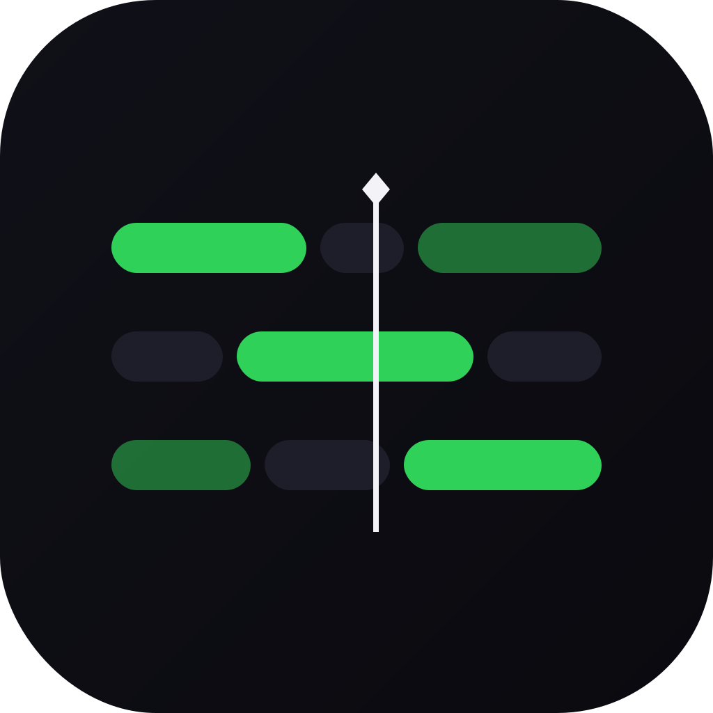
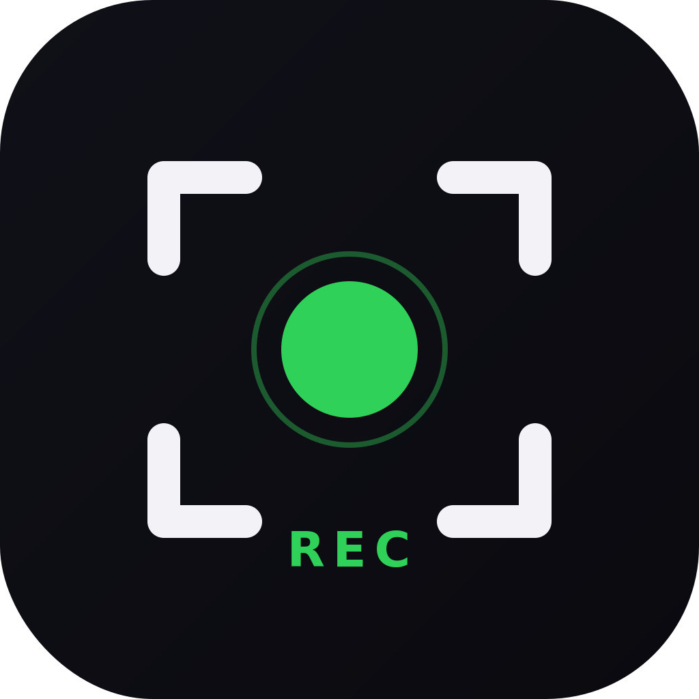
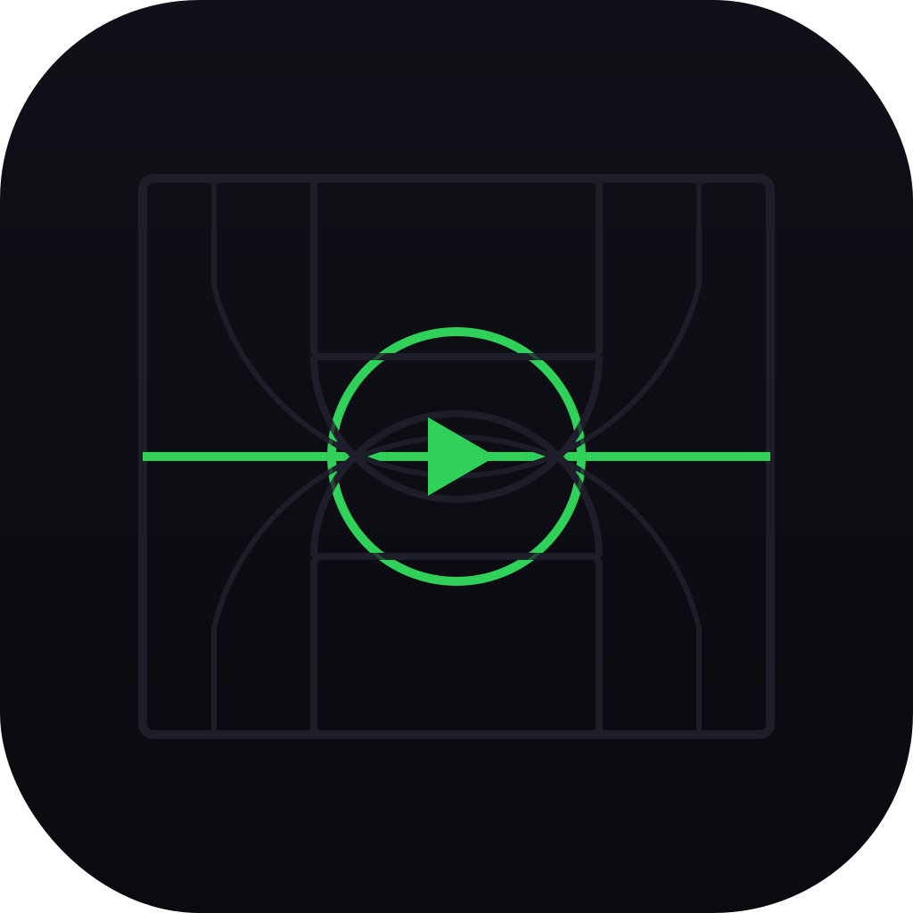

# ClipCourt — App Icon Concepts

Five icon concepts for ClipCourt, a sports video clipping iOS app.

**Design System:** Midnight `#0A0A0F` bg · Rally Green `#30D158` accent · Signal Blue `#0A84FF` actions · Snow `#F2F2F7` text  
**Format:** 1024×1024 SVG, iOS-ready (rounded rect clip path at 224px radius)

---

## 1. Clip Play (`1-clip-play.svg`)
A bold green play triangle slashed diagonally by a dark cut mark — the universal "play" symbol disrupted by a "clip" action. Communicates *video + cutting* instantly. Strongest single-glyph icon; works at any size.

## 2. Highlight Reel (`2-highlight-reel.svg`)
A segmented ring (alternating green and dark arcs) with a white play button at center. Evokes a film reel or progress indicator — the idea of *selected highlights* within a longer timeline. Feels premium and sporty.

## 3. Timeline (`3-timeline.svg`)
Three horizontal bars with green and dark segments, bisected by a white playhead marker. Directly represents a video editing timeline with multiple tracks. Signals *tool* and *precision*. Most literal of the five.

## 4. Viewfinder (`4-viewfinder.svg`)
Corner brackets framing a green recording dot with a subtle pulse ring, plus a "REC" label. Camera/capture aesthetic — says *record the moment*. Clean, recognizable, works well at small sizes thanks to high-contrast bracket corners.

## 5. Court Lines (`5-court-lines.svg`)
An abstract basketball half-court layout with green center line, center circle, and a play button at mid-court. Subtle court markings (keys, three-point arcs) in dark tones. The most *sports-specific* concept — immediately says "basketball" while the play button ties it to video.

---

### Recommendation
**Concept 1 (Clip Play)** is the strongest for brand recognition — bold, simple, reads at 29px. **Concept 5 (Court Lines)** is the most distinctive if leaning into the sports identity. Consider testing both at App Store scale.

### Export Notes
- SVGs use `viewBox="0 0 1024 1024"` — export at 1024×1024 PNG for App Store
- iOS clip path (`rx="224"`) is baked in; remove if exporting through Xcode asset catalog (Xcode applies its own mask)
- No transparency — all icons have solid dark backgrounds
